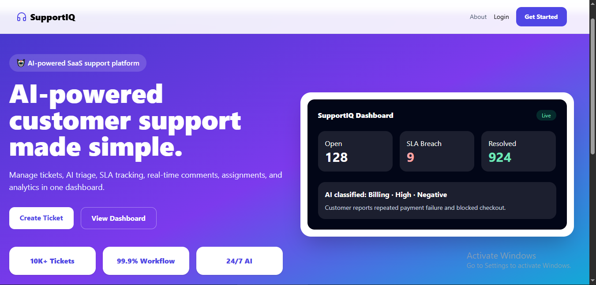

<div align="center">

# 🎧 SupportIQ  
### 🤖 AI Customer Support Ticketing System


<br/>


<br/>

**A production-style SaaS customer support platform with AI ticket triage, SLA tracking, real-time comments, attachments, notifications, audit logs, and role-based dashboards.**


</div>

---

## 📸 Project Preview

<div align="center">



</div>

---

## 🚀 Overview

**SupportIQ** is an AI-powered MERN customer support ticketing system. Customers create tickets, AI classifies priority/category/sentiment, agents resolve tickets with real-time comments, and admins monitor SLA breaches, analytics, agents, notifications, and audit logs.

## ✨ Features

- 👤 Customer / 🧑‍💻 Agent / 🛡️ Admin roles
- 🔐 JWT auth + bcrypt password hashing
- 🤖 AI triage: priority, category, sentiment, summary, tags
- 🎫 Ticket workflow: Open → In Progress → Waiting Customer → Resolved → Closed
- 💬 Real-time comments with Socket.io
- 📎 Attachments with validation
- ⏱️ SLA due dates and breach checks
- 🔔 Notifications
- 📜 Audit logs
- 📊 Dashboards and analytics
- 🧩 Clean responsive SaaS UI

## 🧠 AI Triage Rules

| Output | Examples |
|---|---|
| Category | Billing, Account Access, Bug Report |
| Priority | Low, Medium, High, Critical |
| Sentiment | Positive, Neutral, Negative, Angry, Urgent |
| Tags | login, billing, bug, refund, api |

Critical keywords include: `account hacked`, `security issue`, `data loss`, `system down`, `production outage`, `cannot access account`.

## ⏱️ SLA Rules

| Priority | First Response | Resolution |
|---|---:|---:|
| Critical | 1 hour | 6 hours |
| High | 4 hours | 24 hours |
| Medium | 12 hours | 48 hours |
| Low | 24 hours | 72 hours |

## 🧰 Tech Stack

| Layer | Technology |
|---|---|
| Frontend | React, Vite, Tailwind CSS, React Router, Axios, Recharts, Lucide React |
| Realtime | Socket.io |
| Backend | Node.js, Express.js |
| Database | MongoDB, Mongoose |
| Auth | JWT, bcryptjs |
| Security | Helmet, CORS, express-rate-limit, express-validator |
| AI | Node rule-based fallback + optional FastAPI service |

## 🏗️ Architecture

```text
React Frontend
   |
   | REST API + JWT + Socket.io
   v
Express Backend
   |
   | Mongoose ODM
   v
MongoDB
   |
   | Optional HTTP JSON
   v
FastAPI AI Service / Node Rule-Based AI Fallback
```

## 📁 Project Structure

```text
supportiq-ai-ticketing-system/
├── frontend/
├── backend/
├── ai-service/
├── docs/
├── screenshots/
├── docker-compose.yml
├── README.md
└── .gitignore
```

## ⚙️ Run Locally

```bash
docker compose up -d mongo
```

```bash
cd ai-service
python -m venv venv
venv\Scripts\activate
pip install -r requirements.txt
uvicorn app.main:app --reload --port 8000
```

```bash
cd backend
npm install
copy .env.example .env
npm run dev
```

```bash
cd frontend
npm install
copy .env.example .env
npm run dev
```

URLs:

```text
Frontend: http://localhost:5173
Backend:  http://localhost:5000
AI:       http://localhost:8000
```

## 🔑 Demo Accounts

```text
Admin:    admin@example.com / Admin12345
Agent:    agent@example.com / Agent12345
Customer: customer@example.com / Customer12345
```

## 📌 CV Bullet

> Developed SupportIQ, an AI-powered MERN customer support ticketing system with role-based dashboards, ticket workflows, AI priority/category/sentiment detection, real-time comments, SLA tracking, file attachments, notifications, audit logs, and admin analytics.

<div align="center">

### ⭐ If you like this project, give it a star!


</div>
